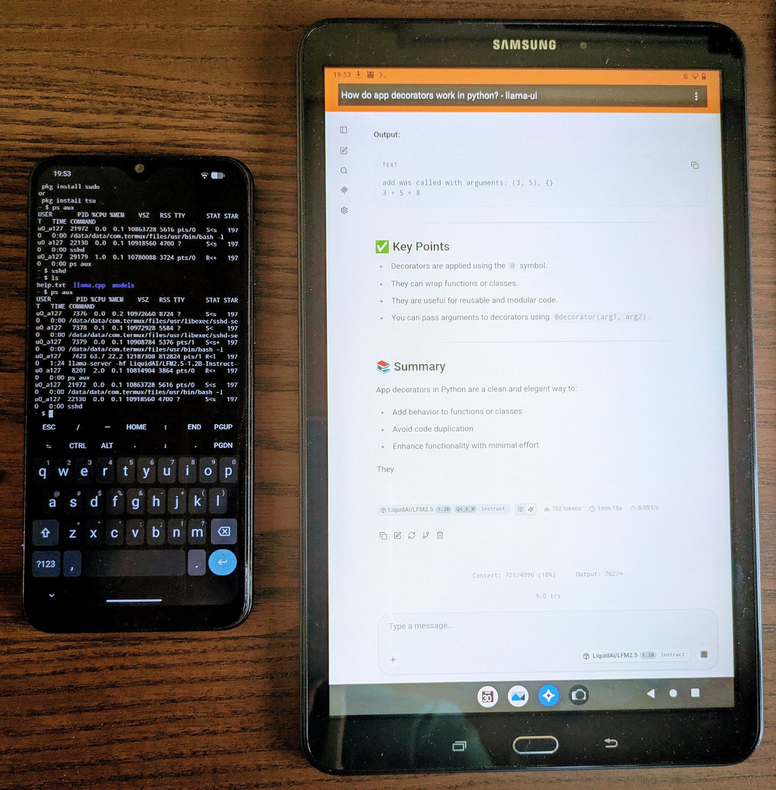

*Yesterday I made an AI server run on my broken 6 year old phone.* In the same week as GitHub moved to [usage based pricing](https://github.blog/news-insights/company-news/github-copilot-is-moving-to-usage-based-billing/) and a week after we learnt that a company accidentally spent [$500 million on Claude AI in one month alone](https://techstartups.com/2026/05/28/company-accidentally-spent-500-million-on-claude-ai-in-one-month-after-forgetting-usage-limits/), I dug out a discard piece of technology to host an LLM.

Now, I'm not saying we're all going to solve the massive cost problem that AI currently has by rummaging around in the back of our drawers. The first model I tried was [LFM2.5-1.2B-Instruct](https://huggingface.co/LiquidAI/LFM2.5-1.2B-Instruct-GGUF), which is a very small language model (SLM) running at a pedestrian 9 tokens per second. The phone in question is a Samsung M21, released in 2020 with 4GB of RAM and an Exynos 9611 octa-core processor (4x2.3GHz and 4x1.7GHz cores) so it obviously won't win any accolades for speed. But given the age of the tech, quite frankly I was impressed it ran anything at all.

What I will say is that this represents the kind of mindset shift that I think we'll be seeing more of through 2026 and beyond. Gone are the days of paying by the PRU (premium request unit), irrespective of the complexity, and instead the user will be forced to count the cost in tokens and the rate. This kind of change is likely to force most users to become more sophisticated in balancing their goals with cost efficient consumption of cloud models. It'll force others to run small models locally, albeit probably on their workstations or laptops rather than their phones.

## A usable agent on your network

This hack isn't just a stunt though; it has real utility. In coding harnesses like OpenCode, you are able to define subagents and specify the model type and the provider (or in my case the local openAI endpoint). Often these subagents are given specific roles and restricted tools to perform deterministic tasks, such as websearches, code linting or security audits. One benefit of a subagent is that they are spawned with a clean context, which means that they don't require a large context window to operate. This is the kind of thing I will be experimenting with SLMs on my phone (and other discarded hardware), along with a more capable model (probably cloud based) to orchestrate. Running subagents on local hardware will become an increasingly common use case given the price hike for cloud models.

## What next?

Look out for my further blog and project posts for more details on how I flashed a lightweight OS on the phone to maximise available RAM and how I installed and configured llama.cpp; also the models I will be experimenting with and my notes after some time of usage.
