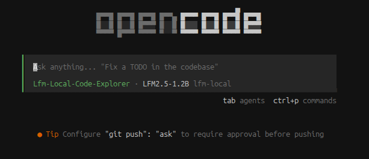

This post continues from [AI llama-server on a phone](/posts/ai-llama-server-on-a-phone/) with a detailed walkthrough of every step needed to flash LineageOS, set up Termux, build llama.cpp, and serve a small language model over your local network.

*Not interested in the whole walkthrough? Maybe you're interested in jailbreaking phones but not AI; perhaps you want to explore hosting local AI models but have no interest in the messy world of Android and phone hardware? I've deliberately separated out the elements so you can pick and choose what you want to read.*

## Prerequisites

To follow along from end to end you'll need:
- An older Android phone (this guide uses a Samsung Galaxy M21, but works for other devices - practical limit around 4GB RAM)
- A PC with ADB (Android Debug Bridge) and Odin (for Samsung devices)
- USB cable to connect your phone
- A few hours of patience
- Backups of anything you care about (this **will** wipe your phone)

The Samsung Galaxy M21 is a good candidate because it's affordable, has reasonable specs (4GB RAM, Exynos 9611), and is supported by the LineageOS community (if not LineageOS directly - see [https://wiki.lineageos.org/devices/](https://wiki.lineageos.org/devices/) for officially supported hardware). 

## Part 1: Preparing Your Phone

If you just want to run the AI server on your stock Android phone (or any other hardware) then ignore this and go straight to [part 3](#part-3-setting-up-termux). Running on a computer and not a phone or tablet? Jump to [part 4](#part-4-building-llamacpp) and set up the AI server straight away.

### Step 1.1: Enable Developer Options and USB Debugging

1. Go to **Settings → About Phone**
2. Tap **Build Number** 7 times until you see "Developer mode enabled"
3. Go to **Settings → Developer Options**
4. Enable **USB Debugging**
5. Connect your phone to your PC with USB

### Step 1.2: Unlock the Bootloader

This step varies by manufacturer. For Samsung:

```bash
adb reboot bootloader
# Your phone enters Download Mode (large text at top)
# Hold Volume Up to enter Fastboot (if available), otherwise proceed to Odin (the primary tool for Samsung devices)
```

**Warning:** Unlocking the bootloader will wipe your device.

1. Download **Odin** from a trusted source (search "Samsung Odin")
2. Put your phone in **Download Mode**: Power Off → Hold Volume Down + Power + Home
3. Open Odin, select your phone in the device list
4. In the **Option** tab, uncheck "Auto Reboot"
5. In **Download Mode**, click **Unlock** or use ADB:
   ```bash
   adb reboot download
   # Then use Odin to send unlock command
   ```

I've flashed a few phones and tablets in the past (both Samsung and non-Samsung devices) but for this phone in particular I was surprised by a security feature I hadn't encountered before: **"KG State Prenormal"**. This is a security feature that prevents flashing unsigned ROMs. If you encounter this:
1. In the original Android OS (called the stock "ROM"), ensure the phone is on your WiFi network and connected to the internet, with the correct date set. This will register your device on Samsung's servers.
1. Turn off WiFi and sever your connection to the internet.
1. Temporarily set your phone's date to at least 3 months before (I set to January 1, 2026).
1. Leave Android and power off. Then boot into Download Mode (varies by phone but mine needed Power Down + Power Up and then connection by USB to my PC)
1. Finally, you should see the words "KG STATE: Checking" and you are able to install other ROMs (like LineageOS) and recovery utilities (like TWRP).


After bootloader unlock and bypassing KG STATE, your phone reboots with stock ROM but is now unlocked.

### Step 1.3: Flash TWRP (TeamWin Recovery Project)

TWRP is a custom recovery that lets you flash custom ROMs like LineageOS.

1. Download the appropriate TWRP image for your device from [dl.twrp.me](https://dl.twrp.me/)
   - For M21: `twrp-3.7.1_12-0-m21.img.tar`
2. Extract the `.img.tar` file to get `recovery.img`
3. Boot into Download Mode again
4. In Odin:
   - Load `recovery.img` into the **Recovery** slot
   - Click **Start**

5. Once flashed, reboot into recovery:
   ```bash
   adb reboot recovery
   ```

You should see the TWRP interface (blue/orange theme, touch controls).

## Part 2: Flashing LineageOS

If you had already unlocked your phone for other reasons and wanted to try LineageOS, here is the place in the guide to start. Also start here if you want to upgrade LineageOS or try an even lighter weight OS (like [Droidian](https://droidian.org/)).

### Step 2.1: Download LineageOS

1. Go to [lineageos.org](https://lineageos.org/) and find your device
2. Download the latest stable build (or use XDA Forums for older devices with community support)
   - For M21: Look for unofficial LineageOS 23.2 builds on XDA. The version will be a delicate balance: recent enough to maximise support; old enough to be frugal on memory and compute.
3. Transfer the `.zip` file to your phone via USB or download it directly using TWRP

### Step 2.2: Wipe and Flash

1. Boot into TWRP recovery (Power + Volume Up or Volume Down, depending on your device)
2. Go to **Wipe → Format Data** and type `yes` to clear encryption (you did backup your files, right?)
3. Go to **Install** and select the LineageOS `.zip` file
4. Swipe to confirm flash
5. Go to **Wipe → Dalvik/ART Cache** (optional but recommended)
6. **Reboot System** — LineageOS will boot for the first time (may take a few minutes)

Congratulations! You now have a lightweight OS with much less background RAM usage than stock Android.

>[!TIP]
>Top tip if you end up flashing the wrong ROM image (like I did initially) and soft brick your phone. Simply flash the TWRP recovery image to both the recovery and boot partitions to flush the dud OS and guarantee booting into TWRP.


### Step 2.3: Verify RAM Usage

LineageOS on an M21 idles at roughly 0.8 GB RAM compared to stock Android at 1.6 GB. For the Samsung M21, this means around 3.2GB for running the AI server and model. Your mileage may vary, depending on specific phone and carrier bloatware.

```bash
adb shell
free -h
# Should show ~3.2 GB free out of 4 GB total
```

## Part 3: Setting Up Termux

This next step works whether you have followed the previous two and flashed a custom ROM to your phone or if you are just using your phone with the standard Android OS.

### Step 3.1: Install Termux

1. Install **F-Droid** (an open-source app store) from [f-droid.org](https://f-droid.org/)
2. Open F-Droid and search for **Termux**
3. Install it

Alternatively, download the Termux `.apk` directly from [termux.com](https://termux.com/).


### Step 3.2: Initial Setup

Open Termux and run:

```bash
termux-setup-storage
# Grant permission when prompted
apt update && apt upgrade -y
```

### Step 3.3: Install SSH Server

So you can manage the phone remotely:

```bash
pkg install openssh
passwd
# Set a password for SSH (you'll use this to connect remotely)
sshd
# SSH server now runs on port 8022
```

Find your phone's IP address:

```bash
ip a | grep inet
# Look for an IP like 192.168.x.x or 10.0.x.x
```

I personally prefer to set a static IP address for my devices using my router so that addresses aren't guesswork.

From your PC, test SSH access:

```bash
ssh -p 8022 u0_aXXX@<phone-ip>
# Username shown in your Termux prompt (e.g., u0_a387)
# Enter the password you set
```

Once you've tested ssh using a password I highly recommend using an encryption key for secure quick access going forward. There are plenty of guides online and you only need a couple of commands (`ssh-keygen` and `scp`) to generate a key and copy the public key over to the phone (or any other device you might be using.)

### Step 3.4: Install tmux

For keeping long-running processes alive after SSH disconnect:

```bash
pkg install tmux
```

## Part 4: Building llama.cpp

This is where things become more exciting. We'll build llama.cpp from source so that it runs optimally for the target hardware. If you are using a Windows, Mac or Linux machine, or are happy to use a generic Android arm64 pre-built binary, you can just install that instead from the same [GitHub repository](https://github.com/ggml-org/llama.cpp/releases) as below.

### Step 4.1: Install Build Dependencies

These are needed to build the binary file, written in C/C++.

```bash
pkg install cmake ninja build-essential git
```

### Step 4.2: Clone and Build

```bash
git clone --depth 1 https://github.com/ggml-org/llama.cpp
cd llama.cpp
cmake -B build -DGGML_OPENMP=OFF -DCMAKE_BUILD_TYPE=Release
cmake --build build -j4
```

This takes 10–30 minutes depending on your phone's speed. The `-j4` flag uses 4 threads; adjust based on your CPU core count.

Once complete, the main binary is at `llama.cpp/build/bin/llama-server`.

### Step 4.3: Verify the Build

```bash
./build/bin/llama-server --version
# Should print version info
```

Typing ./build/bin/llama-server each time is a hassle but if you add the following line to the end of your .bashrc file in your phone's home folder you can simply type llama-server and the phone will understand the path:
`export PATH=$PATH:~/llama.cpp/build/bin`. I'll refer to the command `llama-server` in the instructions from now on.

## Part 5: Downloading a Model

### Step 5.1: Understanding Model quantisation

Models are stored in **GGUF format** with different quantisation levels:
- **Q4_K_M**: Good quality, moderate RAM (~0.8 GB for 1.2B model)
- **Q3_K_M**: Lower quality, smaller RAM (~0.6 GB for 1.2B model)
- **Q8_0**: Larger, better quality (~1.2+ GB for 1.2B model)

For a 4 GB phone, **Q4_K_M is optimal** for 1–2B parameter models. 

>[!NOTE] As an aside, [Ollama](ollama.com) typically uses this quantisation as default for local models and some cloud models too, because the memory efficiency is appreciable but the precision loss is not.

### Step 5.2: Download via llama-server

The easiest way is to use llama-server's built-in Hugging Face support:

```bash
llama-server -hf LiquidAI/LFM2.5-1.2B-Instruct-GGUF:Q4_K_M
```

This downloads to `~/.cache/huggingface/hub` and loads automatically. First run takes a minute to download (~600 MB).

### Step 5.3: Model Recommendations

For a 4 GB phone:
- **LFM 2.5 1.2B**: ~9 tok/s and the one I've chosen to test first
- **Qwen 3.5 0.8B**: smaller model so should be quicker. I haven't tested this size version but it's a reasoning model so I have my suspicions about accuracy with so few parameters.
- **SmolLM 1.7B**: Solid middle ground.
- **Gemma 4 2B**: Requires careful tuning, larger context risky
- **FunctionGemma**: small and specifically tuned for function (tool) calling.

## Part 6: Running the Server

### Step 6.1: Manual Start (for Testing)

From your phone's Termux:

```bash
llama-server \
  -hf LiquidAI/LFM2.5-1.2B-Instruct-GGUF:Q4_K_M \
  -c 4096 \
  -t 4 \
  -fit off \
  --host 0.0.0.0 \
  --port 8080
```

**Key flags:**
- `-c 4096`: Context window (adjust down if RAM-constrained)
- `-t 4`: Thread count (use 4 to avoid thermal throttling; 6 is faster but hotter)
- `-fit off`: Disable GPU-like fitting to prevent OOM during loading
- `--host 0.0.0.0`: Bind to all network interfaces (required for network access)
- `--port 8080`: API port

The server starts and prints: `Server listening on http://0.0.0.0:8080`

### Step 6.2: Remote Start via SSH (Using tmux)

From your PC, start the server in a persistent tmux session:

```bash
ssh -p 8022 u0_aXXX@<phone-ip> \
  "tmux new-session -d -s llm 'cd ~/llama.cpp && llama-server -hf LiquidAI/LFM2.5-1.2B-Instruct-GGUF:Q4_K_M -c 4096 -t 4 -fit off --host 0.0.0.0 --port 8080'"
```

The server now runs even after you disconnect. To check on it:

```bash
ssh -p 8022 u0_aXXX@<phone-ip> tmux attach -t llm
# Press Ctrl+B then D to detach (server keeps running)
```

### Step 6.3: Verify Network Accessibility

From any machine on your network:

```bash
# Open web UI in browser:
http://<phone-ip>:8080/

# Test API with curl:
curl http://<phone-ip>:8080/v1/chat/completions \
  -H "Content-Type: application/json" \
  -d '{"model":"LFM2.5-1.2B","messages":[{"role":"user","content":"Hello"}]}'
```

You should get a JSON response with the model's reply.

## Part 7: Integration with OpenCode

Now that you have an OpenAI-compatible API running on your phone, you can use it as a model in a terminal user interface such as **OpenCode** or other tools that support OpenAI-compatible endpoints. However, it is probably best used as a local subagent because these often have a narrower focus and minimal context, which suits a small local model better than the primary agent.

In your OpenCode configuration, add:

```json
  "provider": {
    "lfm-local": {
      "options": {
        "baseURL": "http://192.168.1.210:8080/v1",
        "apiKey": "sk-placeholder"
      },
      "models": {
        "LFM2.5-1.2B": {
          "id": "LFM2.5-1.2B",
          "name": "LFM2.5-1.2B",
          "limit": {
            "context": 4000,
            "output": 4096
          }
        }
      }
    }
  },
  "agent": {
    "lfm-local-code-explorer": {
      "description": "Fast-local SLM for code search and exploration tasks. Uses LFM2.5-1.2B hosted locally on device 192.168.1.210. Optimized for quick file searches, pattern matching, and navigating codebases without unnecessary explanations.",
      "model": "lfm-local/LFM2.5-1.2B",
      "mode": "subagent",
      "tools": {
        "bash": true
      },
      "instructions": "You are a fast code search and exploration assistant. Use Bash for grep, ripgrep, find, and file system operations. Provide concise, actionable results without extensive explanations. Focus on speed and accuracy for locating files, functions, patterns, and understanding code structure.",
      "color": "#4caf50"
    }
  }
}
```
As a bonus, if you added this to your `opencode.json` configuration you would get an agent the same accent colour as this website!



In the example above, I have configured a locally hosted LFM2.5-1.2b model to use bash tools to explore over a local folder structure. However, you could define lightweight subagents to delegate various tasks to your phone like:
- Code linting and formatting checks
- Web searches (with an MCP server)
- Recipe retrieval (like the [recipe_recall](/projects/2026-04-26-recipe-recall) MCP server I made last year)
- Any deterministic task that doesn't need a large context or complex reasoning

**Tips for optimization:**
- Reduce `-c` (context) if you hit OOM errors
- Increase `-t` (threads) carefully; 4–6 is sweet spot for M21
- Use `-fit off` to avoid unexpected crashes during model loading
- Monitor thermal throttling with `watch -n 1 'grep cpu /proc/cpuinfo'`

## Troubleshooting

### Server crashes after a few minutes
- **Cause:** Thermal throttling or OOM
- **Fix:** Reduce `-t` (threads) to 2–3, or reduce `-c` (context) to 2048

### `bind: Address already in use`
- **Cause:** Port 8080 already in use
- **Fix:** Kill the old process or use a different port: `--port 8081`

### Model won't load / OOM kill
- **Cause:** Not enough free RAM
- **Fix:** Use `--host 0.0.0.0 -fit off`, reduce context size, or use a smaller model

### SSH connection refused
- **Cause:** SSH daemon not running
- **Fix:** Open Termux and run `sshd` again, or add to startup script

## What's Next?

Now that you have a working inference server, consider:
1. **Testing different models** to find the best quality/speed tradeoff
2. **Integrating with your AI harness** (like OpenCode) to spawn subagents
3. **Building MCP servers** for specialized tasks (e.g., web search, recipe lookup)
4. **Exploring Droidian** (Debian native OS) if you need more RAM for larger models

The cost perspective is compelling: your phone is already paid for, the electricity cost is minimal, and you get a capable inference endpoint for tasks that don't need a powerful model. Also, if your target device is old then you have much less to lose if you go wrong. I've used many different devices like these (phones, kindles, tablets, Raspberry Pi) to test projects I'd never have dared to do on my main computer. With this AI server under your belt, what other hardware will you try?

## References

- [LineageOS Official](https://lineageos.org/)
- [TWRP Project](https://twrp.me/)
- [llama.cpp Repository](https://github.com/ggml-org/llama.cpp)
- [Termux Documentation](https://termux.dev/)
- [Hugging Face Model Hub](https://huggingface.co/)
- [OpenCode Project](https://opencode.ai/)
